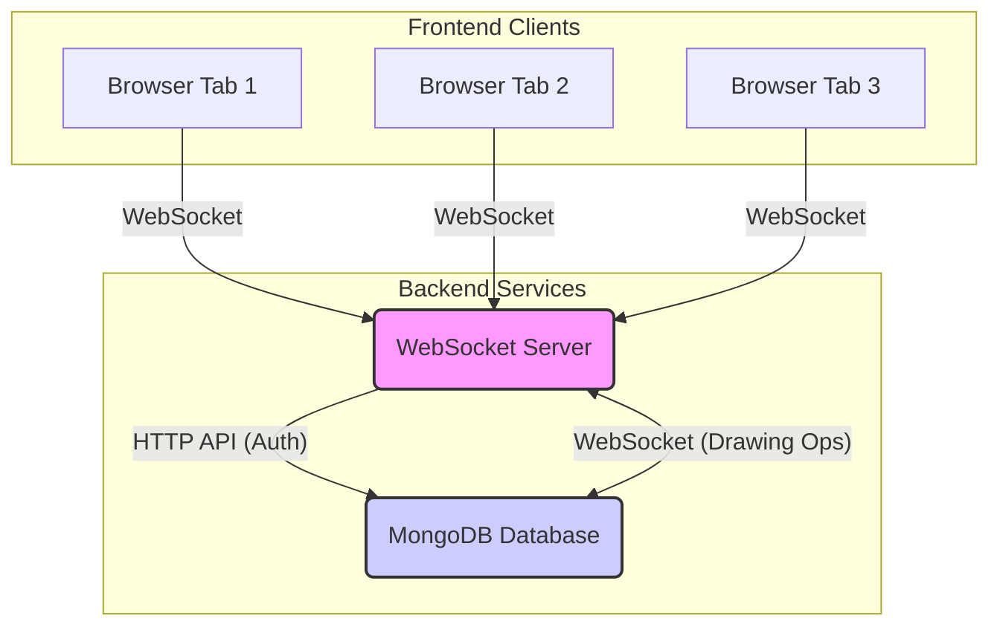

# Distributed Drawing Board - Project Overview

## Executive Summary

This project implements a real-time collaborative drawing application that demonstrates advanced distributed systems concepts through a **client-server architecture with persistent data storage and user authentication**. The system enables multiple users to draw simultaneously on a shared canvas while maintaining consistency, fault tolerance, and automatic recovery, with all drawing operations and user data securely stored in a database.

## Project Overview

The Distributed Drawing Board is a web-based collaborative drawing application where multiple users can draw together in real-time. This system uses a **central WebSocket server** that manages the authoritative state, facilitates communication between browser clients, and **persists all drawing operations and user account information to a MongoDB database**. The application demonstrates core distributed systems principles including centralized state management, client-side fault tolerance, state synchronization, and secure user authentication.

## Technologies Used

### Frontend Technologies

- **React 18.3.1** - Modern UI framework with hooks for state management
- **TypeScript** - Type-safe development with enhanced code reliability
- **Vite** - Fast build tool and development server
- **Tailwind CSS** - Utility-first CSS framework for responsive design
- **Lucide React** - Modern icon library for intuitive interface
- **HTML5 Canvas** - High-performance drawing surface
- **BroadcastChannel API** - Used for client-side user activity detection across tabs
- **LocalStorage** - Used for persistent user ID, name, and color **after successful authentication**

### Backend Technologies (WebSocket Server & API)

- **Node.js** - JavaScript runtime environment
- **Express** - Minimalist web framework for HTTP API endpoints (registration, login, health checks)
- **WebSocket (ws)** - Real-time, centralized state synchronization and broadcasting
- **MongoDB (via Mongoose ORM)** - NoSQL database for persistent storage of drawing operations and user accounts.
- **bcryptjs** - Library for hashing user passwords securely.
- **UUID** - Unique identifier generation for users and drawing operations
- **dotenv** - For managing environment variables (e.g., MongoDB URI, server port)
- **Event Sourcing** - All changes tracked as immutable events (drawing operations)

## ✅ Why It's a Good Fit for Distributed Systems

### 1. **Multiple Autonomous Clients**

- Each browser tab operates as an independent client connecting to a central WebSocket server
- Users can join/leave dynamically without system disruption
- Automated agents could easily be added to the system

### 2. **Shared Resource Contention**

- Multiple users compete for canvas drawing space
- Real-time cursor tracking shows active user positions
- Conflict resolution handled by the server (e.g., ensuring order of operations) **and persisted to MongoDB**.

### 3. **Centralized State Management with Client Synchronization**

- **Central WebSocket server** maintains the authoritative state (drawing operations, active users)
- Clients receive full state updates on connect/reconnect and incremental updates in real-time.
- **Server ensures consistency and persistence of drawing operations by saving them to MongoDB.**

### 4. **Client-side Fault Tolerance**

- System continues operation when client nodes disconnect (server maintains state **and persists to database**)
- Automatic reconnection of clients to the server
- State recovery when clients rejoin the network (via server state sync **from database**)

### 5. **Real-time Coordination**

- Sub-second latency for drawing operations via WebSocket
- Live cursor tracking across all connected clients
- Immediate visual feedback for all user actions

### 6. **Client-Server Architecture for Robustness**

- Focus shifted from peer-to-peer concepts to a robust client-server model for simplified consistency and persistence.
- Server manages primary state, clients consume and update.
- **User authentication layer adds security and personalized experiences.**

## Design Highlights

### Modern, Production-Ready Interface

- **Clean, Professional Design** - Apple-level aesthetics with careful attention to detail
- **Responsive Layout** - Optimized for desktop, tablet, and mobile devices
- **Intuitive Tool Selection** - Visual feedback for active tools and settings
- **Real-time Status Indicators** - Live system health and connection status
- **Secure User Login/Registration UI** - Polished authentication forms.

### Advanced User Experience

- **Live Cursor Tracking** - See other users' cursors with names and colors
- **Visual Tool Feedback** - Immediate preview of brush size and color
- **Smooth Animations** - Micro-interactions enhance user engagement
- **Grid Overlay** - Subtle visual aid for precise drawing
- **Personalized User Experience** - Users identified by their registered username and chosen color.

### Accessibility & Usability

- **Color-coded Users** - Each user assigned unique color for identification
- **Clear Visual Hierarchy** - Organized toolbars and status panels
- **Hover States** - Interactive feedback for all clickable elements
- **Responsive Grid System** - Adaptive layout for different screen sizes

## Key Features

### Drawing Tools

- **Multiple Drawing Tools** - Pen, eraser, line, rectangle, circle
- **Customizable Brush Sizes** - 6 different size options (2px to 24px)
- **Color Palette** - 10 carefully selected colors for drawing
- **Shape Tools** - Geometric shapes with real-time preview

### Collaboration Features

- **Real-time Synchronization** - Instant updates across all connected clients via WebSocket
- **User Presence Indicators** - Live list of connected users with status
- **Cursor Tracking** - See where other users are drawing in real-time
- **User Identification** - Unique colors and names for each participant
- **User Authentication** - Secure registration and login for unique user identities.

### System Management

- **State Persistence** - Drawing state is maintained on the server **and persistently stored in MongoDB, surviving server restarts and deployments.**
- **Network Health Monitoring** - Real-time system status indicators
- **Canvas Clearing** - Coordinated reset across all clients via server command.
- **Client Fault Tolerance** - Clients automatically reconnect and recover state upon disconnection **by fetching historical operations from the database.**
- **Centralized Coordination** - The WebSocket server acts as the primary coordinator for managing the shared drawing state, client interactions, and database operations.

### Advanced Capabilities

- **Event Sourcing** - Complete operation history for replay **from MongoDB**
- **Version Control** - State versioning for consistency guarantees
- **Heartbeat Monitoring** - Server-side detection of inactive clients

## System Architecture

### Client-Server-Database Architecture

### Communication Layer

- **WebSocket Protocol** - Enables full-duplex communication between clients and server for real-time drawing operations and cursor updates.
- **HTTP/REST API** - Used for user registration and login requests between frontend and backend.
- **Event-Driven Architecture** - All system changes propagated as events (drawing operations, user updates, state sync, authentication status).
- **Message Types** - Drawing operations, user management (login/logout), state sync, cursor updates, heartbeats, clear canvas.

### Data Flow

1.  **User Authentication (Client to Server to Database):**
    - Client sends login/register request (HTTP POST) to Server API (`/api/login` or `/api/register`).
    - Server validates credentials (or creates new user) by interacting with **MongoDB (User collection)**. Passwords are hashed with bcryptjs.
    - Server sends authentication response (success/failure, user ID, username, color) back to Client.
2.  **User Action (Client) → Drawing operation message → Server → Database:**
    - Authenticated Client performs a drawing action on its local canvas.
    - The client sends a `drawing_operation` message (via WebSocket) to the WebSocket server.
    - The server receives the operation, **saves it persistently to the `operations` collection in MongoDB**, adds it to its `currentOperations` history, and then broadcasts this new `drawing_operation` to all _other_ connected clients (and potentially back to the sender for confirmation).
3.  **Server → Database → All Clients (State Synchronization):**
    - All connected clients receive the `drawing_operation` message and update their local canvas by applying the new operation.
    - If a client disconnects and then reconnects (e.g., browser refresh, tab close/reopen), it sends `client_connect_info` with its persistent user ID to the server.
    - The server fetches the complete `currentOperations` history **from MongoDB** and active user list.
    - The server responds with a `state_sync` message containing the full history and active users list.
    - The reconnecting client receives the `state_sync` and re-renders its canvas with the complete drawing history.

### Client-Server-Database Interaction Logic

This project employs a robust client-server-database model to manage the collaborative drawing experience. The server acts as the authoritative source for the shared canvas state and user data, interacting with MongoDB for persistence, while clients interact with this state in real-time.

**Client (Browser Tab) Responsibilities:**

- **User Interface (UI) Rendering:** Displays the current state of the drawing canvas, user cursors, and authentication forms.
- **User Input Handling:** Captures drawing actions, tool selections, and **login/registration credentials.**
- **Local State Management:** Manages transient UI state, user-specific information, and **persists authenticated user ID, name, and color in LocalStorage for session continuity.**
- **Sending Operations to Server:** Converts user drawing actions into `DrawingOperation` messages and sends them to the WebSocket server.
- **Sending Authentication Requests:** Sends HTTP POST requests for user registration and login.
- **Receiving State Updates:** Listens for WebSocket messages from the server, including `drawing_operation` (for real-time updates) and `state_sync` (for full state updates on connection/reconnection).
- **Applying Operations:** Renders received drawing operations onto its local HTML5 Canvas.
- **Reconnection Logic:** Automatically attempts to reconnect to the server if the connection is lost, and requests the full state upon successful reconnection.

**Server (Node.js WebSocket Server & Express API) Responsibilities:**

- **Central State Management:** Maintains the authoritative `currentOperations` array in memory, backed by persistent storage in MongoDB.
- **User Authentication & Management:** Handles user registration (`/api/register`) and login (`/api/login`) requests, including password hashing with `bcryptjs` and interaction with the `User` collection in MongoDB.
- **Drawing Operation Persistence:** **Saves all `DrawingOperation` objects to the `Operation` collection in MongoDB.**
- **Message Broadcasting:** Relays `drawing_operation`, `cursor_move`, `user_join`, `user_leave`, `active_users_update`, and `clear_canvas` messages to all connected clients to ensure real-time synchronization.
- **Client Connection Management:** Tracks active clients, assigns ephemeral connection IDs, and associates them with persistent user IDs from the database.
- **State Synchronization (state_sync):** Retrieves the complete `currentOperations` history **from MongoDB** and active user list to newly connected or reconnected clients.
- **Heartbeat Monitoring:** Periodically pings clients to detect inactive connections and manage user presence.
- **Conflict Resolution:** Processes incoming drawing operations sequentially, effectively resolving potential conflicts by ordering, **and persisting them to the database, ensuring data integrity.**

**Interaction Flow:**

1.  **User attempts to Register/Login:** Client sends HTTP POST to server. Server processes, interacts with MongoDB, and responds with auth status and user data.
2.  **Authenticated User Action (Client) → Drawing Operation:** Client performs drawing. Sends `drawing_operation` message via WebSocket to server.
3.  **Server Processes Drawing Operation:** Server receives operation, **persists it to MongoDB (Operation model)**, adds to in-memory `currentOperations`, and broadcasts to _other_ connected clients.
4.  **Clients Update Canvas:** All clients receive `drawing_operation` and apply it to their local canvas.
5.  **Client Reconnection/State Sync:** If a client reconnects, it sends `client_connect_info` to the server.
6.  **Server Fetches State from DB:** Server retrieves the complete `currentOperations` history **from the `Operation` collection in MongoDB** and active users.
7.  **Server Sends State to Client:** Server sends `state_sync` message to the reconnecting client.
8.  **Client Re-renders Canvas:** Reconnecting client receives `state_sync` and re-renders its canvas with the complete drawing history from the database.

## Concepts Demonstrated

### 1. **Centralized State & Consistency**

- **Authoritative Server State** - Server maintains the single source of truth for drawing history.
- **Client Synchronization** - Clients pull full state on connect and receive incremental updates to maintain consistency.
- **Conflict Resolution** - Server implicitly handles concurrent operations by processing them in order of receipt **and persisting them reliably to the database.**

### 2. **Fault Tolerance (Client & Server Perspective)**

- **Client Reconnection** - Clients automatically attempt to reconnect to the server.
- **State Recovery** - Upon reconnection, clients receive the full current state from the server **(loaded from MongoDB)**, recovering any missed operations.
- **Server Resilience** - With MongoDB persistence, drawing history and user data are retained even if the server restarts or crashes.

### 3. **Event Sourcing**

- **Immutable Event Log** - Server stores all drawing actions as an immutable sequence of operations **in MongoDB**.
- **State Reconstruction** - Current drawing state is derived by replaying the operation history **from the database**.

### 4. **Real-time Systems**

- **Low Latency** - Near real-time propagation of drawing actions.
- **Live Updates** - Immediate visual feedback across connected clients.
- **Concurrent Operations** - Multiple users can draw simultaneously with synchronized views.

### 5. **Client-Server Communication**

- **WebSocket Protocol** - Efficient, persistent bidirectional communication.
- **Heartbeat Mechanism** - Used by the server to detect inactive or disconnected clients.
- **HTTP/REST API** - Standard communication for authentication.

### 6. **User Authentication & Security**

- **Secure Registration/Login** - Using `bcryptjs` for password hashing to protect user credentials.
- **Persistent User Identities** - User accounts and their associated drawing color/name are stored in MongoDB.
- **Session Management** - Client-side `LocalStorage` for maintaining user session data.

## Technical Implementation Details

### State Management

- **Server-side Centralized Store** - `currentOperations` array on the Node.js WebSocket server, **backed by the `Operation` model in MongoDB.**
- **Client-side State Hooks** - React `useState` and `useCallback` for local state and event handling.
- **Persistence** - Drawing operations and user data are persistently stored in **MongoDB Atlas**, ensuring data integrity across server restarts and deployments.

### Drawing Engine

- **HTML5 Canvas** - High-performance rendering surface.
- **Event Replay** - Canvas is redrawn by applying all `DrawingOperation` objects **retrieved from MongoDB**.
- **Real-time Preview** - Immediate visual feedback during drawing.

### Network Simulation (Local Development)

- **Browser Tabs as Clients** - Each tab connects to the local WebSocket server.
- **Docker Compose** - Orchestrates frontend, backend, **and local MongoDB service** for easy local setup.

## Testing & Validation

### Application Functionality Testing

1.  **Multi-Client Operation** - Open multiple browser tabs/windows.
2.  **User Authentication** - Test registration of new users and login/logout functionality.
3.  **Concurrent Drawing** - Multiple authenticated users drawing simultaneously.
4.  **Drawing Persistence** - Refresh tabs/reopen browser **after drawing as an authenticated user** to confirm all drawings are retained **and loaded from the database.**
5.  **Real-time Sync** - Verify instant updates across all connected clients.

### System Performance & Resilience

- **Client Disconnection/Reconnection** - Observe automatic reconnection and state recovery.
- **Server State Consistency** - Server ensures all clients receive the same drawing history.

## Future Enhancements

### Advanced Features

- **Undo/Redo System** - Operation rollback capabilities (requires server-side undo stack).
- **Layer Management** - Multiple drawing layers.
- **Export Functionality** - Save drawings as images (e.g., PNG).
- **Advanced Shapes** - Bezier curves, text annotations.
- **User Authentication/Rooms** - Private drawing sessions.

### Distributed Systems Improvements

- **Database Persistence** - For long-term storage of drawing operations beyond server memory.
- **Load Balancing (for server)** - Distribute client connections across multiple server instances.
- **Cross-Device Sync** - Ensure robustness across diverse network conditions.
- **Offline Capabilities** - Allow drawing when temporarily disconnected, then sync.

## Conclusion

This Distributed Drawing Board successfully demonstrates core distributed systems concepts through an engaging, real-world application. The system showcases robust client-server real-time communication, centralized state management, fault tolerance (from the client's perspective), and drawing history persistence, all while providing an intuitive user experience. The implementation proves that complex distributed systems principles can be made accessible through modern web technologies, creating a foundation for understanding larger-scale distributed applications.

The project serves as both a functional collaborative tool and an educational demonstration of how distributed systems handle the fundamental challenges of coordination, consistency, and fault tolerance in real-world scenarios.
