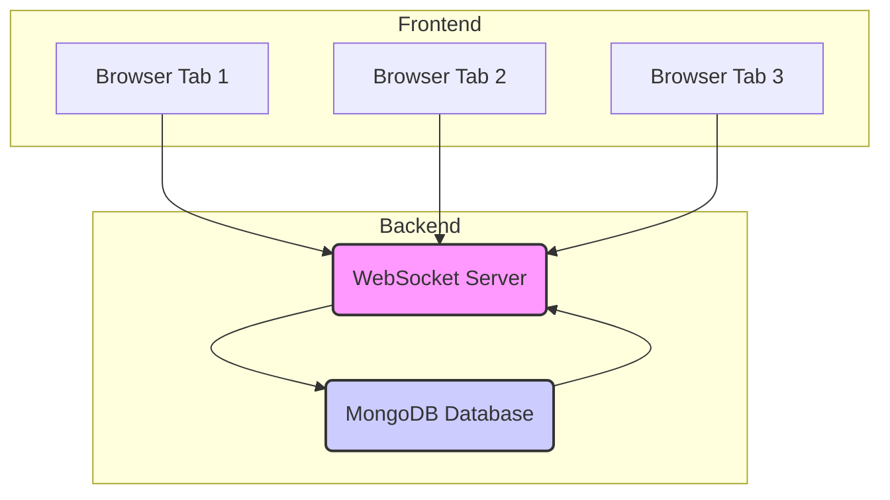

# Distributed Drawing Board

A real-time collaborative drawing application demonstrating advanced distributed systems concepts through a peer-to-peer architecture. Multiple users can draw together on a shared canvas, with consistency, fault tolerance, and automatic recovery across distributed browser nodes.

## Features

- Real-time collaborative drawing
- **User Authentication (Registration & Login)**
- **Persistent Drawing History across sessions, refreshes, and server restarts using MongoDB**
- Cross-device collaboration through WebSocket
- Leader election and consensus
- Fault tolerance and automatic recovery
- Live cursor tracking and user presence
- Event sourcing and state versioning
- Responsive, modern UI (React + Tailwind CSS)

## Technologies Used

- React 18
- TypeScript
- Vite
- Tailwind CSS
- WebSocket (ws)
- Express
- **MongoDB (via Mongoose ORM)**
- **bcryptjs (for password hashing)**
- HTML5 Canvas
- Docker
- Nginx
- UUID (for unique operation IDs)
- dotenv (for environment variables)

## Getting Started

### Prerequisites

- Node.js (v16+ recommended)
- npm or yarn
- Docker (for containerized deployment)
- **MongoDB Atlas account (for cloud database) or local MongoDB instance**

### Local Development

1. Clone the repository:

```bash
git clone https://github.com/HamzaFerati/drawingboard_distributed.git
cd drawingboard_distributed
```

2. Install frontend dependencies:

```bash
npm install
# or
yarn install
```

3. Install server dependencies:

```bash
cd server
npm install
# or
yarn install
cd ..
```

4. **Set up Environment Variables for Local Development:**

   - **For the Server:** Create a `.env` file inside the `server/` directory.
     ```
     # server/.env
     MONGODB_URI=mongodb://localhost:27017/drawingboard
     PORT=3002 # Or any available port, 3001 is default if not set
     ```
   - **For the Frontend:** Create a `.env` file in the project root directory.
     ```
     # .env (in project root)
     VITE_WS_URL=ws://localhost:3002 # Match your server's port
     ```

5. **(Recommended) Run with Docker Compose:**

   This is the easiest way to run both the frontend and the WebSocket server, and a local MongoDB instance.

   ```bash
   docker-compose up --build
   ```

   Then, open your browser and navigate to `http://localhost:3000`

6. **(Alternative) Manual Local Development (if not using Docker Compose):**

   a. Start the WebSocket server:

   ```bash
   cd server
   npm start
   # or
   yarn start
   ```

   b. In a new terminal, start the frontend development server:

   ```bash
   npm run dev
   # or
   yarn dev
   ```

   c. Open the application:

   - For same-browser testing: Open multiple tabs at `http://localhost:5173`
   - For cross-device testing: Have other users access `http://localhost:5173` from their browsers

### Testing the Application

1. **Same Browser Testing**:

   - Open the application in multiple tabs
   - **Register a new user and log in.**
   - Draw in one tab
   - Watch the drawings appear in all other tabs
   - Refresh the browser tab and confirm previous drawings are still visible.
   - Test fault tolerance by closing tabs

2. **Cross-Device Testing**:
   - Start the WebSocket server
   - Have multiple users access the application from different devices
   - **Each user should register/log in.**
   - Draw simultaneously and see real-time updates
   - Test cursor tracking and user presence
   - Confirm drawing history persists when tabs are refreshed or re-opened.

### Docker Deployment

1. **Build and Run with Docker Compose (Recommended for local Docker testing):**

   If you ran `docker-compose up --build` in "Local Development", your images are already built and running.

   To ensure the latest changes are applied and run both services:

   ```bash
   docker-compose up --build
   ```

   Then access the application in your browser: `http://localhost:3000`

2. **Manual Docker Image Build and Run (if not using Docker Compose):**

   a. Build the frontend Docker image:

   ```bash
   docker build -t drawing-board-app .
   ```

   b. Run the frontend container (make sure your WebSocket server is also running, either locally or in Docker):

   ```bash
   docker run -p 3000:80 drawing-board-app
   ```

   c. Build the WebSocket server Docker image:

   ```bash
   cd server
   docker build -t drawing-board-websocket-server .
   cd ..
   ```

   d. Run the WebSocket server container:

   ```bash
   docker run -p 3001:3001 drawing-board-websocket-server
   ```

   e. Access the application:

   - Open your browser and navigate to `http://localhost:3000`
   - Open multiple browser tabs to simulate distributed nodes
   - The application will automatically handle node synchronization

## Architecture

The application now uses a WebSocket server to enable cross-device collaboration. It also leverages a persistent database for storing drawing operations and user data.



## Deployment

### WebSocket Server Deployment (Render.com)

1.  Sign up for a free account at [https://render.com](https://render.com)
2.  Create a new Web Service:
    - Click "New +" and select "Web Service"
    - Connect your GitHub repository
    - Configure the service:
      - Name: `drawing-board-websocket`
      - Environment: `Node`
      - **Root Directory: `server`** (Crucial: Set this in the UI after connecting your repo)
      - Build Command: `npm install`
      - Start Command: `npm start`
      - Health Check Path: `/health`
    - Add **Environment Variables** (in Render Dashboard -> Service -> Environment):
      - `NODE_ENV`: `production`
      - `MONGODB_URI`: `mongodb+srv://<your_db_user>:<your_db_password>@<your_cluster_url>/drawingboard?retryWrites=true&w=majority&appName=Cluster0`
        (Replace `<your_db_user>`, `<your_db_password>`, and `<your_cluster_url>` with your MongoDB Atlas credentials and cluster address. Remember to include `/drawingboard` as the database name in the URI.)
    - Click "Create Web Service"
3.  Wait for deployment to complete
4.  Note the WebSocket URL (e.g., `https://drawingboard-distributed.onrender.com`)

### Frontend Deployment (Vercel)

1.  Sign up for a free account at [https://vercel.com](https://vercel.com)
2.  Create a new project:
    - Click "Add New..." and select "Project"
    - Import your GitHub repository
    - Configure the project:
      - Framework Preset: `Vite`
      - Build Command: `npm run build`
      - Output Directory: `dist`
    - Add **Environment Variables** (in Vercel Dashboard -> Project -> Settings -> Environment Variables):
      - `NODE_ENV`: `production`
      - `VITE_WS_URL`: `wss://drawingboard-distributed.onrender.com` (Replace with your Render.com WebSocket URL, ensuring `wss://` for secure connection)
    - Click "Deploy"
3.  Wait for deployment to complete
4.  Your application will be available at the provided Vercel URL

### Testing the Deployment

1.  Open the Vercel URL in your browser
2.  **Register a new user and log in.**
3.  Open the same URL in another browser or device, and **log in with a different user.**
4.  Draw in one window and verify that the drawing appears in the other window in real-time.
5.  **Refresh the browser and confirm previous drawings are still visible and loaded from the database.**
6.  Check the browser console (F12) for any connection errors or API issues.

### Troubleshooting

If the drawings are not syncing or persisting:

1.  Check the browser console for errors (e.g., `WebSocket not OPEN`, `Failed to fetch` on API calls).
2.  Verify the WebSocket connection:
    - Look for "WebSocket connected" message in the browser console.
    - Check if the Render.com service is running (Render Dashboard).
3.  Check Render.com logs for any server-side errors (e.g., `MongoDB connection error`, `bad auth`).
4.  Ensure both the frontend and WebSocket server are properly deployed and `VITE_WS_URL` is correctly set in Vercel, and `MONGODB_URI` is correctly set in Render.
5.  **Ensure MongoDB Atlas Network Access (IP Whitelist) includes `0.0.0.0/0` (Allow Access from Anywhere).**
6.  **Verify MongoDB Atlas Database User credentials (username and password) are exactly correct in Render's `MONGODB_URI`.**

## Repository

[GitHub - drawingboard_distributed](https://github.com/HamzaFerati/drawingboard_distributed)

## Live Demo

- Vercel Deployment: https://drawingboard-distributed.vercel.app

## Project Overview

See `PROJECT_OVERVIEW.md` for a detailed technical and conceptual breakdown.

## Troubleshooting

### Docker Issues

1. If `docker-compose up --build` fails or you get "Cannot GET":

   - Ensure `docker-compose.yml` is in your project root.
   - Ensure `server/Dockerfile` exists for the WebSocket server.
   - Try `docker-compose up --build --no-cache` to force a complete rebuild.
   - Check terminal logs for specific build errors during `npm run build` steps.
   - Verify `index.html` is present in `/usr/share/nginx/html` inside the running `drawing-board` container using `docker exec <container_id> ls -l /usr/share/nginx/html`.

2. If the container fails to start:

   ```bash
   docker logs <container_name_or_id>
   ```

   (You can find container names/IDs using `docker ps` or in Docker Desktop.)

3. If a port is already in use:

   You might need to stop the conflicting process or change the port mapping in `docker-compose.yml` (e.g., `"3001:80"`).

   To stop a container:

   ```bash
   docker stop <container_name_or_id>
   ```

4. To stop and remove all Docker Compose services:

   ```bash
   docker-compose down
   ```

### Development Issues

1. Clear browser cache if state synchronization issues occur
2. Ensure all browser tabs are on the same origin
3. Check browser console for any error messages

## Contributing

1. Fork the repository
2. Create your feature branch (`git checkout -b feature/amazing-feature`)
3. Commit your changes (`git commit -m 'Add some amazing feature'`)
4. Push to the branch (`git push origin feature/amazing-feature`)
5. Open a Pull Request

## License

This project is licensed under the MIT License - see the LICENSE file for details.

---

© Hamza Ferati, Muas Abdulla
